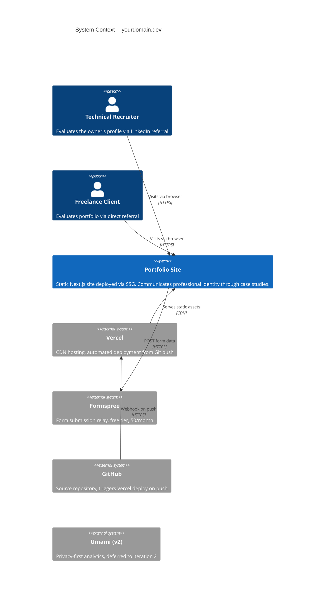
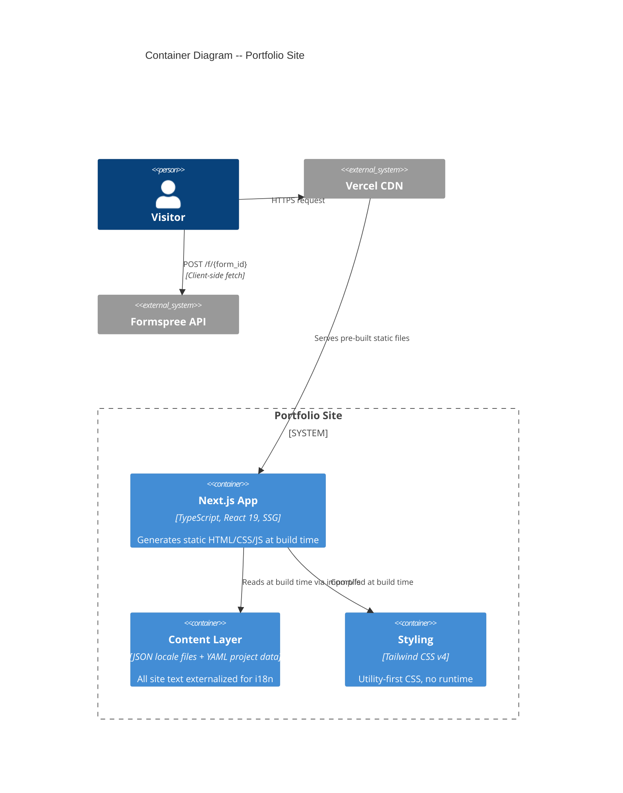
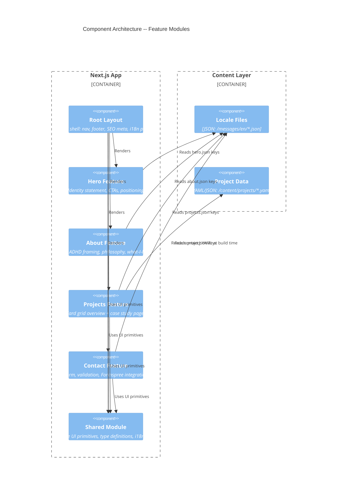
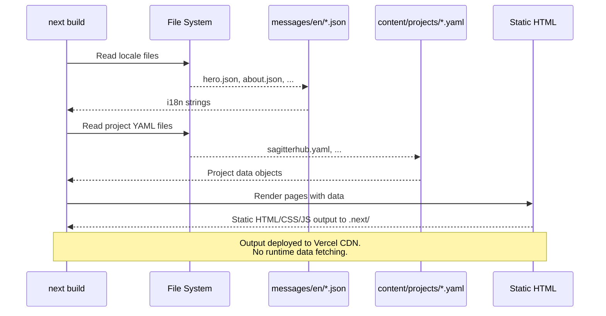
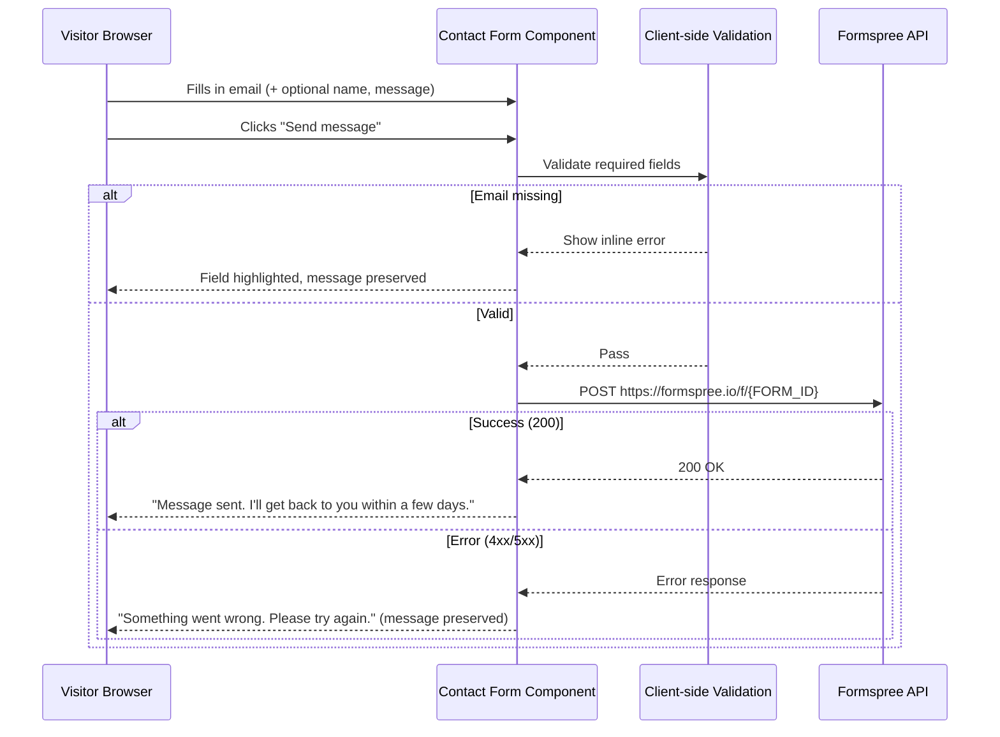
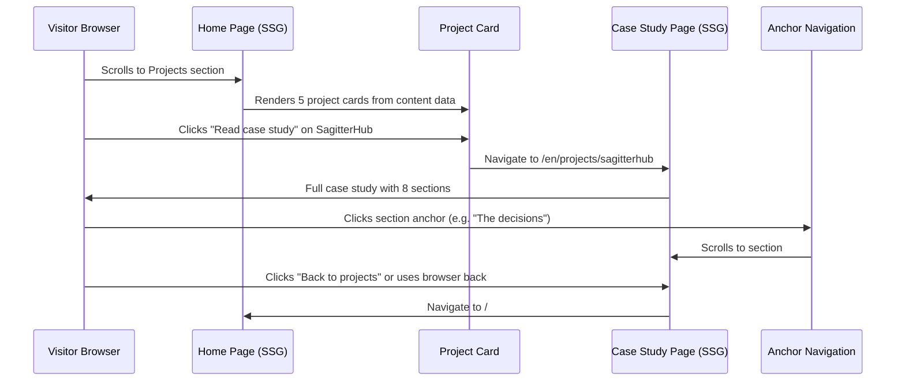
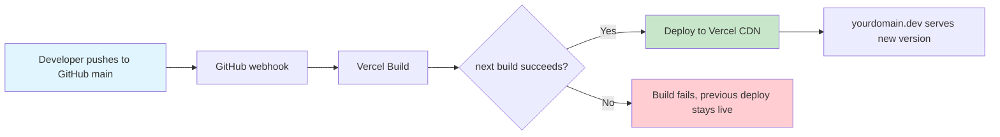

# Architecture Design — Portfolio Template

---

## 1. System Context (C4 Level 1)

The portfolio site is a statically generated website with two external service integrations: deployment/hosting and form submission. No backend exists.



### External Service Contracts

| Service | Protocol | Auth | Free Tier Limit | Fallback |
|---------|----------|------|-----------------|----------|
| Vercel | HTTPS (Git webhook) | GitHub OAuth | 100GB bandwidth/month | Vercel subdomain as staging |
| Formspree | HTTPS POST | Form endpoint ID | 50 submissions/month | Resend (API key based) |
| GitHub | Git + HTTPS | SSH key or PAT | Unlimited public repos | None needed |

---

## 2. Container Diagram (C4 Level 2)

The system is a single Next.js application. There are no separate containers, databases, or services.



### Key Architectural Decisions

- **SSG only**: All pages pre-rendered at build time. No server-side rendering, no API routes (except potentially for form -- but Formspree is called client-side directly).
- **No API routes**: The contact form POSTs directly to Formspree from the browser. No Next.js API route needed.
- **Build-time content**: All content read from static files during `next build`. No runtime data fetching.

---

## 3. Component Diagram (C4 Level 3) -- Feature Modules

The app is organized by feature (site section), not by file type. Each feature module owns its components, its content data, and its locale keys.



---

## 4. Project Directory Structure

```
WebPortfolio/
├── public/                          # Static assets (favicons, OG images)
│   ├── favicon.ico
│   └── og-image.png
│
├── content/                         # Static content data (read at build time)
│   └── projects/
│       ├── sagitterhub.yaml
│       ├── azure-infrastructure.yaml
│       ├── opengl-renderer.yaml
│       ├── ios-habit-tracker.yaml
│       └── unity-soulslike.yaml
│
├── messages/                        # i18n locale files (next-intl convention)
│   └── en/
│       ├── common.json              # Shared strings: nav, footer, meta
│       ├── hero.json
│       ├── about.json
│       ├── projects.json            # Overview strings + case study section labels
│       └── contact.json
│
├── src/
│   ├── app/                         # Next.js App Router
│   │   ├── [locale]/                # Dynamic locale segment (next-intl)
│   │   │   ├── layout.tsx           # Root layout: nav, footer, i18n provider, metadata
│   │   │   ├── page.tsx             # Home page: assembles Hero + About + Projects + Contact
│   │   │   └── projects/
│   │   │       └── [slug]/
│   │   │           └── page.tsx     # Individual case study page
│   │   ├── layout.tsx               # Top-level HTML shell
│   │   └── not-found.tsx            # 404 page
│   │
│   ├── features/                    # Feature-based modules
│   │   ├── hero/
│   │   │   └── hero-section.tsx
│   │   ├── about/
│   │   │   └── about-section.tsx
│   │   ├── projects/
│   │   │   ├── project-card.tsx
│   │   │   ├── project-grid.tsx
│   │   │   └── case-study-layout.tsx
│   │   └── contact/
│   │       ├── contact-section.tsx
│   │       └── contact-form.tsx
│   │
│   ├── shared/                      # Cross-feature reusable code
│   │   ├── ui/                      # UI primitives (Button, Section, Tag, etc.)
│   │   ├── types/                   # Shared TypeScript interfaces
│   │   │   ├── project.ts
│   │   │   ├── personal-info.ts
│   │   │   └── contact.ts
│   │   └── lib/                     # Utilities
│   │       ├── content-loader.ts    # YAML/JSON content reading at build time
│   │       └── metadata.ts          # SEO metadata generation
│   │
│   └── i18n/                        # i18n configuration
│       ├── config.ts                # Supported locales, default locale
│       ├── request.ts               # next-intl request configuration
│       └── navigation.ts            # Locale-aware navigation helpers
│
├── docs/                            # Project documentation (existing)
│   ├── design/                      # This wave's output
│   ├── requirements/
│   ├── profile/
│   └── ux/
│
├── next.config.ts                   # Next.js configuration
├── tailwind.config.ts               # Tailwind CSS configuration
├── tsconfig.json
├── package.json
└── .github/
    └── workflows/                   # CI (optional, Vercel handles deploy)
```

### Directory Design Rationale

| Decision | Reason |
|----------|--------|
| `src/features/` over `src/components/` | Feature-based organization groups by business domain, not file type. Scales to v2 without restructuring. |
| `content/` at root | Content is data, not source code. Separating it makes it clear that case studies are authored artifacts, not generated. |
| `messages/` at root | next-intl convention. Adding Italian requires only `messages/it/` -- no component changes. |
| `src/shared/` | Cross-cutting concerns (types, UI primitives) live here. Features import from shared; shared never imports from features. |
| `[locale]/` in App Router | next-intl App Router integration. EN-only in v1 but the route structure supports multiple locales without refactoring. |
| `[slug]/` for case studies | Dynamic routing. Each project YAML maps to a slug. Adding a project means adding a YAML file -- no code change needed. |

---

## 5. Data Flow Diagrams

### 5.1 Page Load (SSG)



### 5.2 Contact Form Submission



### 5.3 Case Study Navigation



---

## 6. i18n Architecture

### Strategy

next-intl with App Router integration. All user-facing strings live in JSON files under `messages/{locale}/`. The `[locale]` dynamic route segment enables locale-based routing.

### File Structure

```
messages/
└── en/                     # v1: English only
    ├── common.json          # Nav labels, footer, meta defaults
    ├── hero.json            # Hero section strings
    ├── about.json           # About section strings
    ├── projects.json        # Overview labels + case study section headings
    └── contact.json         # Form labels, placeholders, states
```

### Locale File Schema (example: hero.json)

```json
{
  "primaryStatement": "I don't work for duty or money. I work to build something I'm proud of.",
  "name": "Your Name",
  "role": "Software Engineer",
  "tagline": "Systems Thinker",
  "supportingLine": "I see architectures where others see tasks.",
  "ctaPrimary": "View my work",
  "ctaSecondary": "Get in touch"
}
```

### Content vs. Locale Separation

| Type | Location | Format | Read When |
|------|----------|--------|-----------|
| UI strings (labels, CTAs, headings) | `messages/en/*.json` | JSON | Build time via next-intl |
| Project content (case studies) | `content/projects/*.yaml` | YAML | Build time via content-loader |

**Rationale**: UI strings are short, repetitive, and locale-dependent -- JSON is the standard for i18n libraries. Project content is long-form, structured, and authored -- YAML is more readable for narrative content.

### Adding a New Language (v2)

1. Create `messages/it/` with translated JSON files
2. Add `"it"` to the supported locales in `src/i18n/config.ts`
3. Optionally translate project YAML files into `content/projects/it/`
4. No component changes required

### Routing

| URL | Locale | Page |
|-----|--------|------|
| `/en` | English | Home (hero + about + projects + contact) |
| `/en/projects/sagitterhub` | English | SagitterHub case study |
| `/` | Redirect to `/en` (default locale) |

next-intl middleware handles locale detection and redirect.

---

## 7. Navigation Architecture

The site is a single-page vertical scroll for the home page, with dedicated pages for individual case studies.

### Home Page Sections (single scroll)

```
[Nav]
  |-- Hero (#hero)
  |-- About (#about)
  |-- Projects (#projects)
  |-- Contact (#contact)
[Footer]
```

### Navigation Component

- Fixed/sticky top nav with section links (anchor scroll)
- Nav items: About, Projects, Contact (Hero is the landing -- no nav link needed)
- On case study pages: nav persists, with "Back to projects" contextual link

### Case Study Internal Navigation

Long case studies (SagitterHub, Azure) include an anchor-based section navigator at the top:

```
[The problem] [What I saw] [The decisions] [Beyond the assignment]
[What didn't work] [The bigger picture] [For non-specialists] [Stack]
```

---

## 8. SEO and Metadata Strategy

### Per-Page Metadata

| Page | Title | Description |
|------|-------|-------------|
| Home | "Your Name -- Software Engineer" | Positioning statement (from hero) |
| SagitterHub case study | "SagitterHub -- Your Name" | Case study hook |
| Azure case study | "Azure Infrastructure -- Your Name" | Case study hook |
| Personal project | "{Project Name} -- Your Name" | Project hook |

### Open Graph

Each page generates OG tags for LinkedIn sharing:
- `og:title`, `og:description`, `og:image`, `og:url`, `og:type`
- Default OG image: `public/og-image.png`
- Case study pages may override with project-specific images (v2)

### Sitemap

Next.js App Router generates `sitemap.xml` automatically via `src/app/sitemap.ts`.

---

## 9. Performance Budget

| Metric | Target | Strategy |
|--------|--------|----------|
| LCP | < 2.5s | SSG pre-rendering, no runtime data fetching |
| FCP | < 1.8s | Minimal JS bundle, Tailwind CSS purged |
| CLS | < 0.1 | No dynamic content injection, font preloading |
| Total JS | < 100KB gzipped | No heavy client libraries, SSG reduces client JS |
| Total CSS | < 15KB gzipped | Tailwind purge removes unused classes |

---

## 10. Deployment Architecture



### Deployment Configuration

| Setting | Value |
|---------|-------|
| Build command | `next build` |
| Output directory | `.next` |
| Node version | 20.x |
| Framework preset | Next.js (auto-detected by Vercel) |
| Environment variables | `NEXT_PUBLIC_FORMSPREE_ID` |
| Domain | `yourdomain.dev` (custom domain on Vercel) |
| Preview deploys | Enabled on PR branches |

### Environment Variables

| Variable | Scope | Description |
|----------|-------|-------------|
| `NEXT_PUBLIC_FORMSPREE_ID` | Client | Formspree form endpoint ID |

Only one environment variable. No secrets needed -- the Formspree form ID is public (same as embedding a form).
