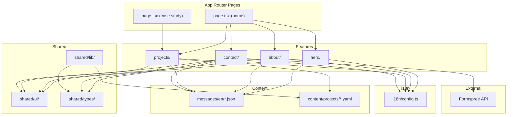

# Component Boundaries -- Personal Portfolio CV Site

# Wave: DESIGN -- 2026-03-01

---

## Boundary Principles

1. **Feature modules are independent**: Each feature (hero, about, projects, contact) can be developed, tested, and modified without affecting others.
2. **Data flows down**: Content data flows from the content layer into features via props. Features never modify content data.
3. **Shared module is dependency-free**: `src/shared/` never imports from `src/features/`. Features import from shared.
4. **i18n is invisible to features**: Features call `useTranslations('namespace')` and receive strings. They do not know about locale files, paths, or loading.

---

## Feature Module Boundaries

### Hero Feature (`src/features/hero/`)

| Aspect | Boundary |
|--------|----------|
| **Responsibility** | Render identity statement, supporting line, CTAs |
| **Inputs** | i18n strings from `hero.json` |
| **Outputs** | Anchor links to `#projects` and `#contact` |
| **External dependencies** | None |
| **Content ownership** | `messages/en/hero.json` |
| **Does NOT** | Fetch data, manage state, render project information |

---

### About Feature (`src/features/about/`)

| Aspect | Boundary |
|--------|----------|
| **Responsibility** | Render professional identity, ADHD framing, values, philosophy, what-I-look-for |
| **Inputs** | i18n strings from `about.json` |
| **Outputs** | None (terminal section, no outgoing navigation) |
| **External dependencies** | None |
| **Content ownership** | `messages/en/about.json` |
| **Does NOT** | Display project data, link to case studies, manage form state |

---

### Projects Feature (`src/features/projects/`)

| Aspect | Boundary |
|--------|----------|
| **Responsibility** | Render project card grid (overview) and individual case study pages |
| **Inputs** | i18n strings from `projects.json` + project data from `content/projects/*.yaml` |
| **Outputs** | Navigation links to individual case study pages (`/en/projects/[slug]`) |
| **External dependencies** | None |
| **Content ownership** | `messages/en/projects.json` + `content/projects/*.yaml` |
| **Does NOT** | Submit forms, render about content, access Formspree |

**Sub-components**:
- `project-card.tsx`: Single card in the overview grid. Receives one project's summary data.
- `project-grid.tsx`: Arranges cards. Receives the full project list.
- `case-study-layout.tsx`: Renders the 8-section case study template. Receives one project's full data.

---

### Contact Feature (`src/features/contact/`)

| Aspect | Boundary |
|--------|----------|
| **Responsibility** | Render contact form, validate input, submit to Formspree, display success/error states |
| **Inputs** | i18n strings from `contact.json`, Formspree endpoint ID from env |
| **Outputs** | POST request to Formspree |
| **External dependencies** | Formspree (HTTPS POST) |
| **Content ownership** | `messages/en/contact.json` |
| **Does NOT** | Store submissions, send emails directly, validate on server side |
| **State** | Client-side form state: idle, submitting, success, error |

**Sub-components**:
- `contact-section.tsx`: Section wrapper with headline and subtext.
- `contact-form.tsx`: Form logic, validation, submission, state transitions.

---

### Shared Module (`src/shared/`)

| Aspect | Boundary |
|--------|----------|
| **Responsibility** | Provide reusable UI primitives, type definitions, and utilities |
| **Inputs** | Props from feature components |
| **Outputs** | Rendered UI elements, typed interfaces, utility functions |
| **Does NOT** | Import from features, manage i18n, access external services |

**Sub-modules**:

| Sub-module | Contents | Used By |
|------------|----------|---------|
| `shared/ui/` | Button, Section wrapper, Tag, Navigation components | All features |
| `shared/types/` | TypeScript interfaces for Project, PersonalInfo, ContactForm, CaseStudySection | Projects, Contact, content-loader |
| `shared/lib/content-loader.ts` | Functions to read and parse YAML project files at build time | Projects feature (via page-level data loading) |
| `shared/lib/metadata.ts` | SEO metadata generation helpers | App Router layout/pages |

---

### i18n Module (`src/i18n/`)

| Aspect | Boundary |
|--------|----------|
| **Responsibility** | Configure next-intl, define supported locales, provide locale-aware navigation |
| **Inputs** | Locale JSON files from `messages/` |
| **Outputs** | `useTranslations` hook available to all features |
| **Does NOT** | Own any content, render UI, manage routes |

**Files**:
- `config.ts`: Supported locales (`['en']`), default locale (`'en'`)
- `request.ts`: next-intl server-side request configuration
- `navigation.ts`: Locale-aware `Link` and `useRouter` exports

---

## Data Contracts Between Features

### Project Card Data (Overview -> Card)

The project grid passes summary data to each card.

```typescript
// Consumed by: project-card.tsx
// Produced by: content-loader reading YAML
interface ProjectSummary {
  readonly slug: string;
  readonly title: string;
  readonly hook: string;
  readonly type: 'work' | 'personal';
  readonly tags: readonly string[];
}
```

### Case Study Data (Content -> Case Study Page)

Full project data consumed by the case study page.

```typescript
// Consumed by: case-study-layout.tsx
// Produced by: content-loader reading YAML
interface ProjectCaseStudy {
  readonly slug: string;
  readonly title: string;
  readonly hook: string;
  readonly type: 'work' | 'personal';
  readonly sections: {
    readonly theProblem: string;
    readonly whatISaw: string;
    readonly theDecisions: string;
    readonly beyondTheAssignment: string;
    readonly whatDidntWork: string;
    readonly theBiggerPicture: string;
    readonly forNonSpecialists: string;
  };
  readonly stack: readonly string[];
  readonly metrics?: readonly string[];
}
```

### Contact Form State (Form -> Section)

```typescript
// Internal to contact feature
type FormStatus = 'idle' | 'submitting' | 'success' | 'error';

interface ContactFormData {
  readonly name: string;
  readonly email: string;
  readonly message: string;
}
```

---

## Dependency Graph



**Constraints enforced by this graph**:
- No feature imports from another feature
- Shared never imports from features
- External service access only from Contact
- Content accessed only at build time (no runtime fetching)

---

## Cross-Cutting Concerns

| Concern | Owner | Mechanism |
|---------|-------|-----------|
| Navigation | Root layout | Sticky nav rendered in `[locale]/layout.tsx`, anchor links to sections |
| SEO metadata | Root layout + pages | `generateMetadata()` in layout and page files |
| i18n provider | Root layout | `NextIntlClientProvider` wraps all features |
| Error boundaries | Root layout | Next.js built-in error handling |
| 404 handling | `not-found.tsx` | Next.js convention |
| Font loading | Root layout | `next/font` with preload |
