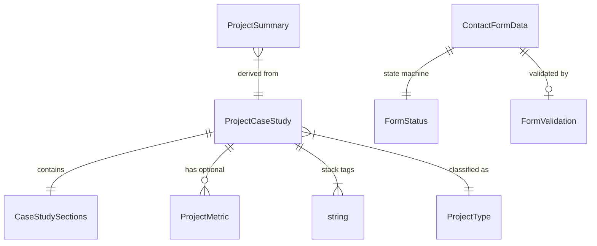

# Data Models -- Personal Portfolio CV Site
# Christian Borrello
# Wave: DESIGN -- 2026-03-01

All models are TypeScript interfaces. Immutability enforced via `readonly` modifiers.
These interfaces live in `src/shared/types/`.

---

## 1. Project Data Model

Represents a project in the portfolio. Source: `content/projects/*.yaml`.

### ProjectSummary (card grid)

```typescript
// src/shared/types/project.ts

/**
 * Minimal project data for the overview card grid.
 * Derived from the full ProjectCaseStudy at build time.
 */
interface ProjectSummary {
  readonly slug: string;           // URL segment: "sagitterhub", "azure-infrastructure"
  readonly title: string;          // Display name: "SagitterHub"
  readonly hook: string;           // 1-2 line hook: "Enterprise platform built right."
  readonly type: ProjectType;
  readonly tags: readonly string[]; // Subset of stack for card display
}

type ProjectType = 'work' | 'personal';
```

### ProjectCaseStudy (full case study page)

```typescript
// src/shared/types/project.ts

/**
 * Full project data for the case study page.
 * Maps 1:1 to a YAML file in content/projects/.
 * The 8-section template is enforced by this type.
 */
interface ProjectCaseStudy {
  readonly slug: string;
  readonly title: string;
  readonly subtitle?: string;      // e.g. "VisureHub Module -- the architectural showcase"
  readonly hook: string;
  readonly type: ProjectType;
  readonly sections: CaseStudySections;
  readonly stack: readonly string[];
  readonly metrics?: readonly ProjectMetric[];
}

/**
 * The 8 mandatory sections of a case study.
 * For personal projects, beyondTheAssignment may be adapted
 * but must still be present.
 */
interface CaseStudySections {
  readonly theProblem: string;
  readonly whatISaw: string;
  readonly theDecisions: string;
  readonly beyondTheAssignment: string;
  readonly whatDidntWork: string;
  readonly theBiggerPicture: string;
  readonly forNonSpecialists: string;
  // stack is a top-level field, not in sections
}

/**
 * Quantifiable metric displayed prominently in the case study.
 */
interface ProjectMetric {
  readonly label: string;          // "Cost savings"
  readonly value: string;          // "~280/month"
  readonly unit?: string;          // "EUR"
}
```

### YAML File Example (sagitterhub.yaml)

```yaml
slug: sagitterhub
title: SagitterHub
subtitle: "VisureHub Module -- the architectural showcase"
hook: "Enterprise platform built right."
type: work

metrics:
  - label: Code coverage
    value: ">90%"
  - label: Architecture
    value: "Hexagonal + DDD + CQRS"

sections:
  theProblem: |
    (Content written by Christian)
  whatISaw: |
    (Content written by Christian)
  theDecisions: |
    (Content written by Christian)
  beyondTheAssignment: |
    (Content written by Christian)
  whatDidntWork: |
    (Content written by Christian)
  theBiggerPicture: |
    (Content written by Christian)
  forNonSpecialists: |
    (Content written by Christian)

stack:
  - .NET 8.0
  - React 19
  - TypeScript
  - Azure
  - Hexagonal Architecture
  - DDD
  - CQRS
  - Event Sourcing
  - TDD
  - Docker
  - GitHub Actions
```

---

## 2. Personal Info Data Model

Represents Christian's public identity. Source: `messages/en/hero.json` and `messages/en/about.json`.

This is not a separate data file -- it is composed from i18n locale strings. The type is documented here for reference, but the actual data lives in locale JSON files.

```typescript
// src/shared/types/personal-info.ts

/**
 * Professional identity displayed across the site.
 * Not a data file -- composed from i18n strings.
 * Documented here for reference and cross-section consistency.
 */
interface ProfessionalIdentity {
  readonly fullName: string;       // "Christian Borrello"
  readonly role: string;           // "Software Engineer"
  readonly tagline: string;        // "Systems Thinker"
  readonly primaryStatement: string;
  readonly supportingLine: string;
}

/**
 * Social and contact links rendered in nav/footer.
 * Source: messages/en/common.json or environment config.
 */
interface SocialLinks {
  readonly email: string;
  readonly linkedin: string;
  readonly github: string;
}
```

---

## 3. Contact Form Data Model

Represents the contact form state and submission payload.

```typescript
// src/shared/types/contact.ts

/**
 * Data submitted through the contact form.
 * Maps to Formspree expected fields.
 *
 * email is required; name and message are optional.
 * This matches the 3-field form specified in RF-05.
 */
interface ContactFormData {
  readonly name: string;           // Optional in UI, always sent (empty string if blank)
  readonly email: string;          // Required -- validated client-side
  readonly message: string;        // Optional in UI, always sent (empty string if blank)
}

/**
 * Form submission state machine.
 *
 * idle -> submitting -> success
 *                   \-> error
 *
 * From error, user can retry (-> submitting).
 * From success, form stays in success state (no reset needed).
 */
type FormStatus = 'idle' | 'submitting' | 'success' | 'error';

/**
 * Validation result for the contact form.
 * Only email has a validation rule (required + format).
 */
interface FormValidation {
  readonly isValid: boolean;
  readonly emailError?: string;    // Inline error message for email field
}
```

### Formspree Submission Contract

```
POST https://formspree.io/f/{FORM_ID}
Content-Type: application/json

{
  "name": "Marco Ferretti",       // or empty string
  "email": "marco@example.com",   // required
  "message": "..."                // or empty string
}

Response 200: { "ok": true }
Response 4xx: { "error": "..." }
```

---

## 4. i18n Key Structure

### Namespace Map

| Namespace | File | Keys |
|-----------|------|------|
| `common` | `messages/en/common.json` | Nav labels, footer text, meta defaults |
| `hero` | `messages/en/hero.json` | Identity statement, CTAs |
| `about` | `messages/en/about.json` | All about section paragraphs |
| `projects` | `messages/en/projects.json` | Section heading, card labels, case study section labels |
| `contact` | `messages/en/contact.json` | Form labels, placeholders, states |

### Key Schema per Namespace

```typescript
// These are not runtime types -- they document the expected JSON structure.
// next-intl provides type safety via its own mechanisms.

// messages/en/common.json
interface CommonMessages {
  readonly nav: {
    readonly about: string;
    readonly projects: string;
    readonly contact: string;
  };
  readonly footer: {
    readonly copyright: string;
    readonly builtWith: string;
  };
  readonly meta: {
    readonly defaultTitle: string;
    readonly defaultDescription: string;
  };
}

// messages/en/hero.json
interface HeroMessages {
  readonly primaryStatement: string;
  readonly name: string;
  readonly role: string;
  readonly tagline: string;
  readonly supportingLine: string;
  readonly ctaPrimary: string;
  readonly ctaSecondary: string;
}

// messages/en/about.json
interface AboutMessages {
  readonly heading: string;
  readonly identity: string;
  readonly adhd: string;
  readonly techPhilosophy: string;
  readonly philosophy: string;
  readonly values: string;
  readonly lookingFor: string;
}

// messages/en/projects.json
interface ProjectsMessages {
  readonly heading: string;
  readonly readCaseStudy: string;
  readonly backToProjects: string;
  readonly sectionLabels: {
    readonly theProblem: string;
    readonly whatISaw: string;
    readonly theDecisions: string;
    readonly beyondTheAssignment: string;
    readonly whatDidntWork: string;
    readonly theBiggerPicture: string;
    readonly forNonSpecialists: string;
    readonly stack: string;
  };
}

// messages/en/contact.json
interface ContactMessages {
  readonly heading: string;
  readonly subtext: string;
  readonly nameLabel: string;
  readonly namePlaceholder: string;
  readonly emailLabel: string;
  readonly emailPlaceholder: string;
  readonly messageLabel: string;
  readonly messagePlaceholder: string;
  readonly submit: string;
  readonly successMessage: string;
  readonly errorMessage: string;
  readonly emailRequired: string;
  readonly emailInvalid: string;
}
```

---

## 5. Content Loader Contract

The content-loader utility reads YAML files and returns typed data.

```typescript
// src/shared/lib/content-loader.ts

/**
 * Reads all project YAML files from content/projects/.
 * Called at build time only (in generateStaticParams or page-level data loading).
 *
 * Returns projects sorted: work projects first, then personal.
 */
function getAllProjects(): readonly ProjectCaseStudy[];

/**
 * Reads a single project by slug.
 * Throws if the YAML file does not exist or fails validation.
 */
function getProjectBySlug(slug: string): ProjectCaseStudy;

/**
 * Derives summary data from a full case study.
 * Used by the project grid to avoid passing full content to cards.
 */
function toSummary(project: ProjectCaseStudy): ProjectSummary;
```

---

## 6. Metadata Contract

SEO metadata generation for pages.

```typescript
// src/shared/lib/metadata.ts

/**
 * Generates Next.js Metadata object for the home page.
 */
function generateHomeMetadata(locale: string): Metadata;

/**
 * Generates Next.js Metadata object for a case study page.
 * Uses project title and hook for title and description.
 */
function generateCaseStudyMetadata(project: ProjectCaseStudy, locale: string): Metadata;
```

---

## Model Relationships


