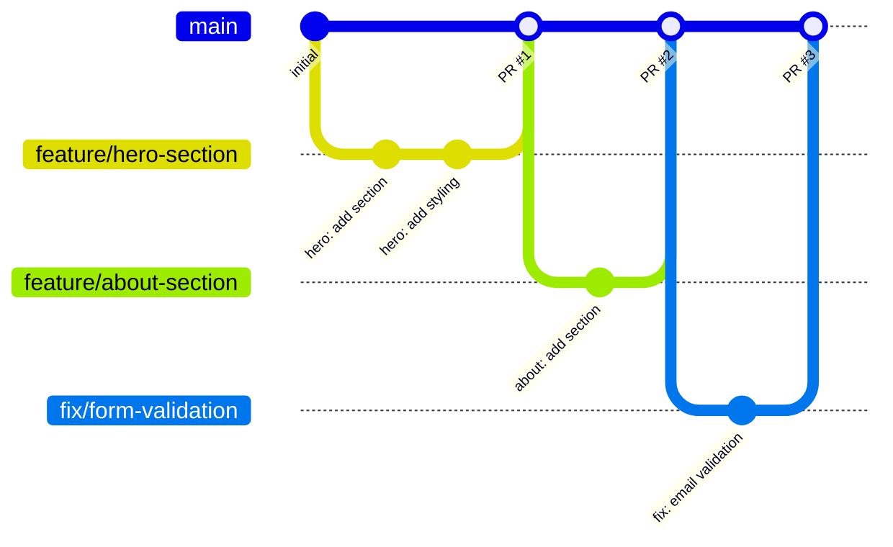
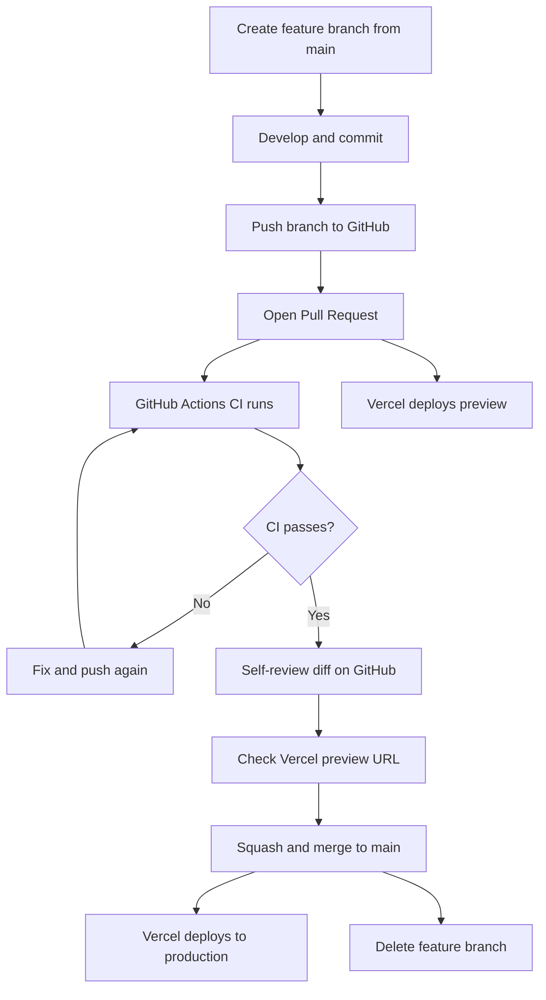

# Branching Strategy -- Personal Portfolio CV Site

# Wave: DESIGN (Infrastructure) -- 2026-03-01

---

## 1. Strategy: GitHub Flow

GitHub Flow is selected over GitFlow, trunk-based development, and release branching.

### Why GitHub Flow

| Alternative | Rejected Because |
|-------------|-----------------|
| GitFlow | Designed for parallel release streams. A portfolio site has one environment (production). `develop`, `release/*`, and `hotfix/*` branches add ceremony with zero benefit. |
| Trunk-based development | Requires feature flags and mature CI/CD for safe direct-to-main commits. Solo developer benefits from PR-based review (self-review discipline, preview deploys). |
| Release branching | No versioned releases. Every merge to main is a release. |

GitHub Flow matches the project constraints: solo developer, single production environment, continuous deployment, PR-based quality gates.

---

## 2. Branch Model



### Rules

1. `main` is always deployable. Every commit on `main` is a production deployment.
2. All work happens on feature branches created from `main`.
3. Feature branches are merged via Pull Request after CI passes.
4. Feature branches are deleted after merge.
5. No long-lived branches other than `main`.

---

## 3. Branch Naming Conventions

### Format

```
{type}/{short-description}
```

### Types

| Prefix | Usage | Example |
|--------|-------|---------|
| `feature/` | New feature or section | `feature/hero-section` |
| `fix/` | Bug fix | `fix/form-validation-error` |
| `chore/` | Maintenance, config, dependencies | `chore/update-dependencies` |
| `docs/` | Documentation only | `docs/add-case-study-content` |
| `style/` | Visual/CSS changes only | `style/adjust-hero-spacing` |

### Naming Rules

- Lowercase only
- Hyphens between words (no underscores, no camelCase)
- Short and descriptive (3-5 words max)
- No ticket/issue numbers required (solo project, no issue tracker)

### Examples for This Project

```
feature/walking-skeleton
feature/hero-section
feature/about-section
feature/project-grid
feature/case-study-template
feature/contact-form
fix/formspree-submission-error
chore/add-prettier-config
docs/sagitterhub-case-study
style/responsive-nav
chore/setup-umami-analytics
```

---

## 4. Pull Request Process

### PR Lifecycle



### PR Template

Create `.github/pull_request_template.md`:

```markdown
## What

Brief description of what this PR does.

## Why

What problem does this solve or what value does it add?

## How to verify

- [ ] CI passes (lint, typecheck, build)
- [ ] Vercel preview deploy looks correct
- [ ] Specific thing to check (if applicable)

## Screenshots

If visual change, add before/after screenshots.
```

### Self-Review Checklist

Since this is a solo project, the PR serves as a self-review checkpoint:

1. Read the full diff on GitHub (not just in the IDE)
2. Verify CI passes (green check)
3. Open the Vercel preview URL and visually verify
4. Check that no hardcoded strings slipped in (all text via i18n)
5. Squash and merge

### Merge Strategy

**Squash and merge** for all PRs.

| Strategy | Used? | Reason |
|----------|-------|--------|
| Squash and merge | Yes | Clean linear history on main. Each merge = one logical change. |
| Merge commit | No | Creates unnecessary merge commits for a solo project. |
| Rebase and merge | No | Rewrites commit hashes. Squash achieves the same clean result. |

Configure in GitHub (Settings > General > Pull Requests):
- Allow squash merging: **Yes** (default)
- Allow merge commits: **No**
- Allow rebase merging: **No**
- Automatically delete head branches: **Yes**

---

## 5. Branch Protection Rules

Configure on GitHub (Settings > Branches > Add rule for `main`):

| Rule | Value | Rationale |
|------|-------|-----------|
| Branch name pattern | `main` | Protect the production branch |
| Require a pull request before merging | Yes | No direct pushes to main |
| Required approvals | 0 | Solo developer -- self-review via PR |
| Require status checks to pass | Yes | CI must be green |
| Required status checks | `quality` | The GitHub Actions job name from `ci.yml` |
| Require branches to be up to date | Yes | Merge conflicts caught before merge |
| Include administrators | Yes | Enforce rules for repo owner too |
| Allow force pushes | No | Protect commit history |
| Allow deletions | No | Prevent accidental main branch deletion |

### Why "Include Administrators" Matters

The developer is the sole contributor and repo admin. Without this flag, branch protection is advisory -- he could push directly to `main` bypassing CI. Enabling it enforces the workflow discipline even when working alone, and is visible to recruiters as a professional practice.

---

## 6. Commit Message Convention

### Format

```
{type}: {short description}

{optional body}
```

### Types

Same as branch prefixes for consistency:

| Type | Usage |
|------|-------|
| `feat` | New feature or section |
| `fix` | Bug fix |
| `chore` | Maintenance, config |
| `docs` | Documentation |
| `style` | Visual/CSS changes |
| `refactor` | Code restructuring without behavior change |

### Examples

```
feat: add hero section with i18n strings
fix: preserve form fields on validation error
chore: configure prettier with tailwind plugin
docs: write sagitterhub case study content
style: adjust project card grid spacing
refactor: extract content-loader utility
```

### Rules

- Lowercase first word after type prefix
- No period at the end
- Present tense imperative mood ("add", not "added" or "adds")
- Body optional -- use for non-obvious reasoning
- Squash merge means the PR title becomes the commit message on `main`

---

## 7. Workflow Summary

```
1. git checkout main && git pull
2. git checkout -b feature/hero-section
3. ... develop ...
4. git add <files> && git commit -m "feat: add hero section"
5. git push -u origin feature/hero-section
6. Open PR on GitHub
7. Wait for CI green + Vercel preview
8. Self-review diff and preview
9. Squash and merge
10. Branch auto-deleted
11. Vercel deploys to production
```

Total cycle time from branch creation to production: < 10 minutes (for small changes during active development).
