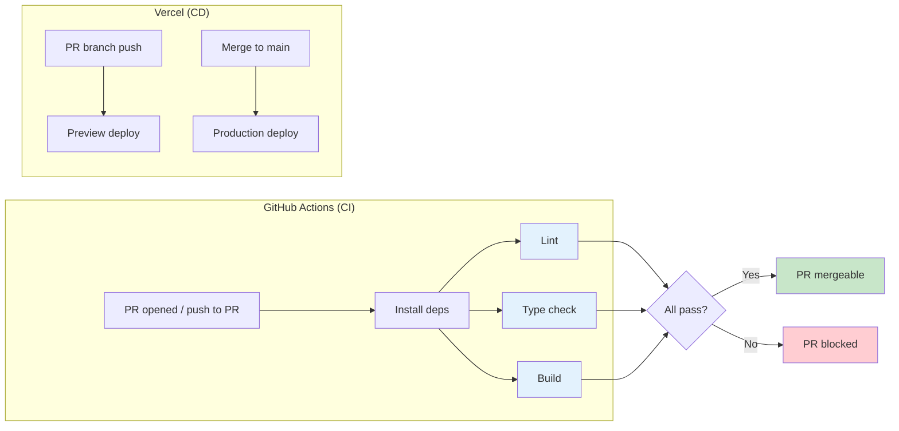

# CI/CD Pipeline Design -- Personal Portfolio CV Site

# Wave: DESIGN (Infrastructure) -- 2026-03-01

---

## 1. Pipeline Philosophy

The CI pipeline serves two audiences:

1. **Developer**: Catch errors before they reach production. Fast feedback.
2. **Recruiters reviewing the GitHub repo**: Demonstrate engineering discipline -- linting, type safety, automated builds are visible proof of quality-first practice.

The pipeline is intentionally lean. Three jobs. No parallelization tricks needed for a < 30s build. No staging environments. No Docker. Vercel handles deployment entirely outside GitHub Actions.

---

## 2. Pipeline Architecture



### Separation of Concerns

| Responsibility | Handled By | Why |
|----------------|------------|-----|
| Code quality (lint, types, build) | GitHub Actions | Runs on every PR, gates merge |
| Preview deploys | Vercel Git integration | Automatic on PR branches, zero config |
| Production deploys | Vercel Git integration | Automatic on merge to main, atomic |
| Rollback | Vercel dashboard | Instant redeploy of previous version |

GitHub Actions does CI (quality gates). Vercel does CD (deployment). No overlap. No custom deploy scripts.

---

## 3. CI Workflow: Quality Gates

### Triggers

| Event | Branches | Action |
|-------|----------|--------|
| `pull_request` | `main` | Run lint + typecheck + build |
| `push` | `main` | Run lint + typecheck + build (post-merge validation) |

### Jobs

All three quality checks run in a single job to minimize free-tier minutes and cold-start overhead. For a static portfolio site, sequential steps in one job are faster than three parallel jobs (each requiring separate `npm ci`).

| Step | Command | Purpose | Failure Blocks Merge |
|------|---------|---------|---------------------|
| Install | `npm ci` | Deterministic install from lockfile | Yes |
| Lint | `npm run lint` | ESLint with next/core-web-vitals rules | Yes |
| Type check | `npx tsc --noEmit` | TypeScript strict mode validation | Yes |
| Build | `npm run build` | Verify SSG generation succeeds | Yes |

### Why No Test Step (Yet)

The walking skeleton has no application tests. The first test will be added with the Hero feature (US-01). When tests exist, the workflow gains a `test` step:

```yaml
- name: Test
  run: npm test
```

This will be added to the workflow when `package.json` has a meaningful `test` script (not the default `echo "Error"` placeholder).

---

## 4. GitHub Actions Workflow File

This file goes to `.github/workflows/ci.yml` in the repository root.

```yaml
name: CI

on:
  pull_request:
    branches: [main]
  push:
    branches: [main]

concurrency:
  group: ${{ github.workflow }}-${{ github.ref }}
  cancel-in-progress: true

jobs:
  quality:
    name: Lint, Type Check, Build
    runs-on: ubuntu-latest
    timeout-minutes: 10

    steps:
      - name: Checkout
        uses: actions/checkout@v4

      - name: Setup Node.js
        uses: actions/setup-node@v4
        with:
          node-version: 20
          cache: npm

      - name: Install dependencies
        run: npm ci

      - name: Lint
        run: npm run lint

      - name: Type check
        run: npx tsc --noEmit

      - name: Build
        run: npm run build
```

### Workflow Design Decisions

| Decision | Rationale |
|----------|-----------|
| `concurrency.cancel-in-progress: true` | If a new push arrives on the same PR, cancel the running workflow. Saves Actions minutes. |
| `timeout-minutes: 10` | Static site build should complete in < 2 minutes. 10-minute timeout catches infinite loops without wasting all 2,000 free minutes. |
| `actions/setup-node@v4` with `cache: npm` | Caches `node_modules` across runs. Reduces install time from ~15s to ~3s on cache hit. |
| `npm ci` over `npm install` | Deterministic install from `package-lock.json`. Fails if lockfile is out of sync. |
| Single job, sequential steps | Three parallel jobs would each need a separate checkout + install (~15s overhead each). One job avoids this. Total pipeline time: ~60-90s. |
| No `npm test` step | Walking skeleton has no tests. Step added when tests exist. Avoids a misleading green check on an empty test suite. |
| Node 20 | LTS version matching Vercel build environment. |

---

## 5. Vercel Integration (CD)

### How It Works

Vercel connects to the GitHub repository via its Git integration (configured in Vercel dashboard, not via GitHub Actions). This is a webhook-based system:

1. **PR branch push**: Vercel builds and deploys a preview URL (e.g., `web-portfolio-abc123.vercel.app`)
2. **Merge to main**: Vercel builds and deploys to production (e.g., `yourdomain.dev`)
3. **Build failure**: Vercel keeps the previous deployment live. No downtime.

### Vercel Build Settings

| Setting | Value |
|---------|-------|
| Framework preset | Next.js (auto-detected) |
| Build command | `next build` (default) |
| Output directory | `.next` (default) |
| Install command | `npm ci` (override default `npm install` for determinism) |
| Node.js version | 20.x |
| Root directory | `.` (repository root) |

### Preview Deploy Behavior

Every PR gets a unique preview URL. This URL:
- Is posted as a comment on the PR by the Vercel bot
- Persists until the PR is closed or a new push overwrites it
- Serves the exact same static output that production would serve

Recruiters reviewing the repository can see preview deploy links on PRs -- another signal of professional workflow.

---

## 6. Branch Protection and CI Gating

### Required Status Checks

Configure in GitHub (Settings > Branches > Branch protection rules > `main`):

| Setting | Value |
|---------|-------|
| Require status checks to pass | Yes |
| Required checks | `quality` (the CI job name) |
| Require branches to be up to date | Yes |
| Require pull request reviews | No (solo developer) |
| Include administrators | Yes (enforce rules even for repo owner) |

### Why "Include Administrators"

The developer is the sole developer and repo admin. Without this setting, he could bypass CI by pushing directly to `main`. Enabling it enforces the discipline of always going through PRs, even when working alone. This is visible to recruiters and demonstrates that the CI pipeline is not optional.

---

## 7. Pipeline Evolution Path

### v1 (Walking Skeleton -- Now)

```
lint -> typecheck -> build
```

### v1.1 (After First Test)

```
lint -> typecheck -> test -> build
```

### v2 (After Umami Integration)

```
lint -> typecheck -> test -> build -> lighthouse-ci
```

Lighthouse CI will validate performance budgets (LCP < 2.5s, CLS < 0.1) automatically on every PR.

### v2+ (If Complexity Grows)

```
lint -> typecheck -> test -> security-scan -> build -> lighthouse-ci
```

Security scanning (`npm audit`, dependency check) added if the dependency count grows beyond 15.

Each evolution is a single step added to the existing workflow. No pipeline restructuring needed.

---

## 8. Local Development Alignment

Developers should run the same checks locally before pushing. Add to `package.json`:

```json
{
  "scripts": {
    "dev": "next dev",
    "build": "next build",
    "start": "next start",
    "lint": "next lint",
    "typecheck": "tsc --noEmit",
    "ci": "npm run lint && npm run typecheck && npm run build"
  }
}
```

The `ci` script mirrors the GitHub Actions pipeline. Run `npm run ci` locally before pushing to avoid waiting for CI feedback.

---

## 9. Estimated Pipeline Performance

| Metric | Expected Value |
|--------|---------------|
| Total pipeline time | 60-90 seconds |
| Install (cached) | ~3-5 seconds |
| Install (cold) | ~10-15 seconds |
| Lint | ~5-10 seconds |
| Type check | ~5-10 seconds |
| Build (SSG) | ~15-30 seconds |
| GitHub Actions minutes/month | < 100 (well within 2,000 free limit) |

### DORA Metrics Alignment

| DORA Metric | Target | How Pipeline Supports It |
|-------------|--------|--------------------------|
| Deployment frequency | Multiple times/day (during active dev) | Merge to main = instant deploy |
| Lead time for changes | < 10 minutes (push to production) | ~90s CI + ~60s Vercel build |
| Change failure rate | < 5% | Three quality gates block broken code |
| Time to restore | < 5 minutes | Vercel instant rollback |

These targets place the project in the "Elite" DORA performance category for deployment frequency and time to restore, which is achievable precisely because the infrastructure is simple.
