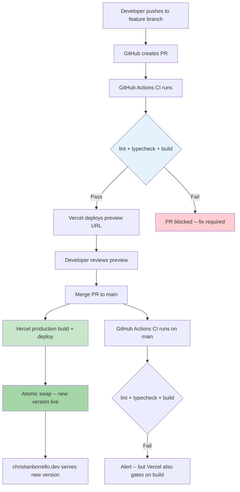

# Platform Architecture -- Personal Portfolio CV Site
# Christian Borrello
# Wave: DESIGN (Infrastructure) -- 2026-03-01

---

## 1. Infrastructure Overview

The portfolio runs as a statically generated Next.js site with zero backend components. The entire platform is three managed services connected by Git webhooks.

| Component | Service | Tier | Role |
|-----------|---------|------|------|
| Source control | GitHub | Free (public repo) | Git hosting, CI execution (Actions), PR workflow |
| Hosting + CDN | Vercel | Free (Hobby) | Build, deploy, CDN edge delivery, preview deploys |
| Contact form relay | Formspree | Free | Receives POST from browser, emails Christian |

### Why This is Sufficient

Before proposing any additional infrastructure, two simpler alternatives were evaluated:

1. **GitHub Pages + Cloudflare**: Free hosting with CDN. Rejected because GitHub Pages does not support Next.js middleware (locale redirect), image optimization, or preview deploys. Would require custom build scripts.
2. **Static HTML on any CDN**: Zero framework. Rejected because it sacrifices i18n routing, component reuse, and the engineering discipline the portfolio itself demonstrates.

Vercel free tier is the simplest infrastructure that supports the full Next.js SSG feature set with zero configuration.

---

## 2. Deployment Flow



### Deployment Characteristics

| Property | Value |
|----------|-------|
| Deploy trigger | Merge to `main` (Vercel Git integration) |
| Deploy type | Atomic (Vercel swaps the entire deployment instantly) |
| Rollback | Instant via Vercel dashboard -- redeploy any previous deployment |
| Preview deploys | Automatic on every PR branch push |
| Build command | `next build` |
| Output | Static HTML/CSS/JS (SSG) |
| Build time | Expected < 30s (static site, no data fetching) |
| CDN propagation | Instant (Vercel edge network) |

### Rollback Procedure

Rollback is a first-class design concern. For a Vercel-hosted static site:

1. **Instant rollback**: Open Vercel dashboard, navigate to Deployments, click "..." on the previous working deployment, select "Promote to Production". Takes effect in seconds.
2. **Git rollback**: `git revert <commit>` and push to `main`. Vercel rebuilds and deploys the reverted state.
3. **Feature flag rollback**: Not needed for v1 (static content, no runtime flags).

Both paths are tested during the walking skeleton verification (Step 9 of the walking skeleton plan).

---

## 3. Environment Management

### Environment Variables

| Variable | Scope | Where Set | Secret? |
|----------|-------|-----------|---------|
| `NEXT_PUBLIC_FORMSPREE_ID` | Client-side (browser) | Vercel project settings + `.env.local` | No -- form IDs are public by design |

**Total secrets: zero.** The Formspree form ID is embedded in client-side HTML (same as any HTML form action URL). No API keys, no tokens, no server-side secrets.

### Environment Files

| File | Purpose | Committed? |
|------|---------|------------|
| `.env.local` | Local development (Formspree ID) | No (in `.gitignore`) |
| `.env.example` | Documents required variables (no values) | Yes |

### Vercel Environment Configuration

Set via Vercel dashboard (Project Settings > Environment Variables):

```
NEXT_PUBLIC_FORMSPREE_ID = <form-id>
Scope: Production, Preview, Development
```

No per-environment variable differences in v1. All environments use the same Formspree form.

---

## 4. Domain Configuration

### Target Domain

`christianborrello.dev`

### DNS Records

| Type | Name | Value | TTL |
|------|------|-------|-----|
| A | @ | `76.76.21.21` | 300 |
| CNAME | www | `cname.vercel-dns.com` | 300 |

### SSL

Automatic via Vercel. The `.dev` TLD requires HTTPS (HSTS preloaded). Vercel provisions and renews Let's Encrypt certificates automatically.

### Verification Steps

1. Add domain in Vercel project settings
2. Configure DNS at registrar
3. Wait for DNS propagation (usually < 10 minutes)
4. Vercel shows "Valid Configuration" in domain settings
5. `curl -I https://christianborrello.dev` returns `200` with valid SSL

### Staging

The Vercel subdomain (`*.vercel.app`) serves as the staging URL until the custom domain is configured. The walking skeleton launches on this subdomain first.

---

## 5. Free Tier Limits and Monitoring

### Vercel Hobby Plan Limits

| Resource | Limit | Expected Usage | Risk |
|----------|-------|----------------|------|
| Bandwidth | 100 GB/month | < 1 GB (portfolio traffic) | None |
| Build minutes | 6,000 min/month | < 100 min (fast SSG builds) | None |
| Serverless functions | 100 GB-hours | 0 (pure SSG, no functions) | N/A |
| Deployments | Unlimited | ~20-30/month during active dev | None |
| Team members | 1 | 1 (solo developer) | N/A |

### Formspree Free Tier Limits

| Resource | Limit | Expected Usage | Risk |
|----------|-------|----------------|------|
| Submissions/month | 50 | < 20 (portfolio contact form) | Low |
| File uploads | None | Not used | N/A |
| Custom redirect | No | Not needed | N/A |

### GitHub Free Tier Limits

| Resource | Limit | Expected Usage | Risk |
|----------|-------|----------------|------|
| Actions minutes/month | 2,000 (public repo) | < 100 min | None |
| Storage | Unlimited (public) | < 100 MB | None |
| Collaborators | Unlimited (public) | 1 | N/A |

### Monitoring Approach (v1)

No dedicated monitoring infrastructure. Operational awareness through:

- **Vercel dashboard**: Build status, deployment logs, bandwidth usage
- **GitHub Actions**: CI pass/fail notifications via email
- **Formspree dashboard**: Submission count and monthly usage
- **Manual check**: Monthly review of all three dashboards (5 minutes)

### Monitoring Approach (v2 -- Planned)

Umami self-hosted analytics (deferred to iteration 2):
- Privacy-first visitor analytics
- Traffic source attribution (UTM parameters)
- Page-level engagement metrics
- Hosted on Railway or Supabase free tier
- Integration: single `<script>` tag in the root layout

---

## 6. Architecture Decision Records

### ADR-PLAT-01: Vercel Over Alternatives

**Status**: Accepted

**Context**: Need zero-cost hosting for a Next.js SSG site with preview deploys and custom domain support.

**Decision**: Vercel Hobby plan.

**Alternatives rejected**:
- Cloudflare Pages: Requires additional configuration for Next.js middleware and image optimization.
- GitHub Pages: No Next.js middleware support, no preview deploys, no atomic rollback.
- Netlify: Comparable to Vercel but Next.js is Vercel-native. No advantage.

**Consequences**: Locked to Vercel for deployment. Migration to another platform is straightforward (static output), but preview deploy URLs would change.

### ADR-PLAT-02: No Monitoring Infrastructure in v1

**Status**: Accepted

**Context**: Portfolio site with expected < 100 visitors/month at launch. Monitoring infrastructure has operational cost (even free tiers require setup and maintenance).

**Decision**: Defer all monitoring to iteration 2. Use dashboard checks.

**Alternatives rejected**:
- Umami from day one: Adds setup complexity to walking skeleton. Delays launch.
- Vercel Analytics: Not available on Hobby plan.

**Consequences**: No visitor metrics until iteration 2. The primary success metric (100 unique visits in 4-6 weeks) cannot be measured until Umami is deployed. Acceptable because the site must exist before it can be measured.

### ADR-PLAT-03: No Secrets Management

**Status**: Accepted

**Context**: The only environment variable (`NEXT_PUBLIC_FORMSPREE_ID`) is a public client-side value.

**Decision**: No secrets manager (no Vault, no GitHub Secrets for app config). Environment variable set directly in Vercel dashboard.

**Consequences**: If a secret is ever needed (e.g., Resend API key for v2 form backend), GitHub Secrets and Vercel encrypted environment variables will be introduced at that point.
