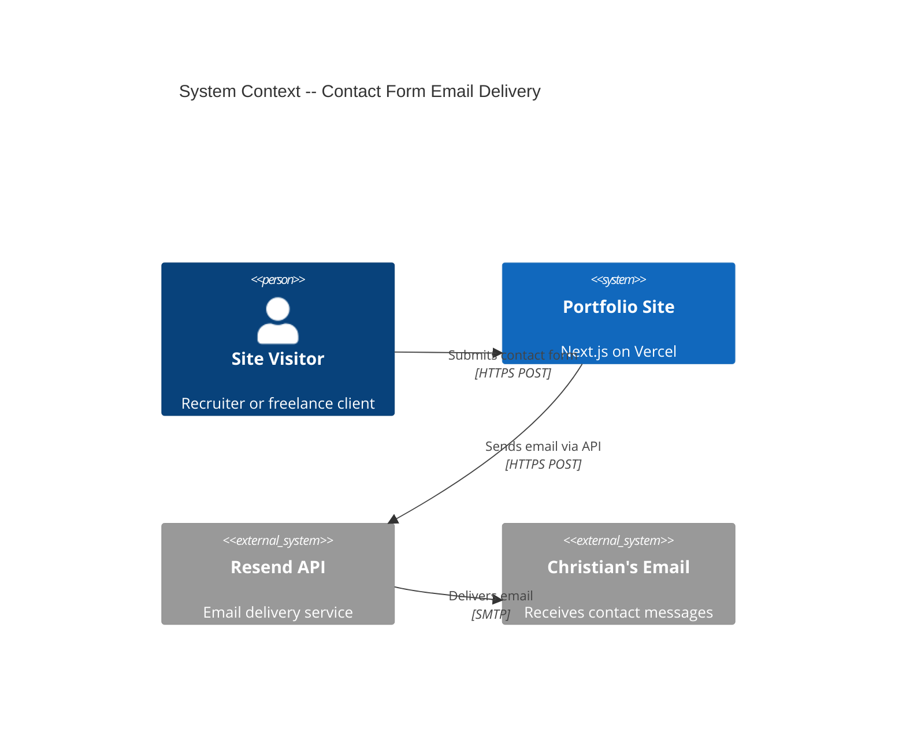
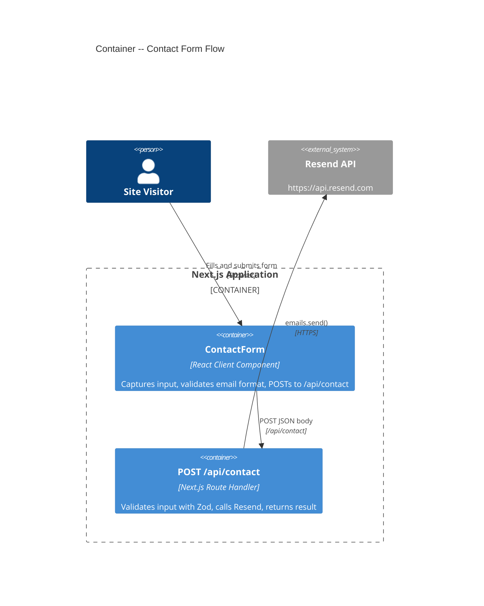

# Architecture Design: Contact Form Resend Migration

## Overview

Replace client-side Formspree POST with a server-side Next.js API route that calls the Resend email API. The form component changes only its fetch URL. The API key stays server-side.

## C4 Context Diagram



## C4 Container Diagram



## Component Flow

```
Browser (ContactForm)
  |
  | POST /api/contact
  | Content-Type: application/json
  | Body: { name?, email, message? }
  |
  v
API Route Handler (src/app/api/contact/route.ts)
  |
  | 1. Parse JSON body
  | 2. Validate with Zod schema
  |    - fail -> 400 + validation errors
  | 3. Call Resend emails.send()
  |    - fail -> 500 + generic error
  | 4. Return 200 + success
  |
  v
Resend API
  |
  v
Christian's inbox
```

## Request/Response Contract

### POST /api/contact

**Request**:
```
POST /api/contact
Content-Type: application/json

{
  "name": "Giulia Marchetti",     // optional, string, max 100 chars
  "email": "giulia@startup.io",   // required, valid email format
  "message": "I have a project…"  // optional, string, max 5000 chars
}
```

**Response -- Success (200)**:
```json
{
  "success": true
}
```

**Response -- Validation Error (400)**:
```json
{
  "success": false,
  "error": "validation_error",
  "details": [
    { "field": "email", "message": "Invalid email address" }
  ]
}
```

**Response -- Server Error (500)**:
```json
{
  "success": false,
  "error": "send_failed"
}
```

## Error Handling Strategy

| Failure Mode | HTTP Status | Client Behavior | Notes |
|---|---|---|---|
| Missing/invalid email | 400 | Show validation error | Zod validation on server mirrors client-side check |
| Name too long (>100) | 400 | Show validation error | Defensive limit |
| Message too long (>5000) | 400 | Show validation error | Defensive limit |
| Resend API error | 500 | Show generic "try again" | Log error server-side for debugging |
| Resend rate limit (429) | 500 | Show generic "try again" | Resend free tier: 100 emails/day |
| Invalid/missing API key | 500 | Show generic "try again" | Deployment configuration issue |
| Network timeout to Resend | 500 | Show generic "try again" | Transient failure |

The client (ContactForm) does not need to differentiate between 500 error types. It already shows a generic error message for any non-ok response. The 400 case with field-level details is available for future use but the current form UI simply shows the existing client-side validation error.

## Client Migration: handleSubmit Changes

The current `handleSubmit` in `contact-form.tsx` checks `response.ok` (HTTP status code) which **remains valid** — the API route returns 200 for success, 400/500 for errors. No change to status-checking logic is needed.

The two changes are:
1. **Fetch URL**: from `FORMSPREE_URL` to `/api/contact`
2. **Request body**: from `FormData` to `JSON.stringify()` with `Content-Type: application/json`

Updated fetch call:
```typescript
const response = await fetch("/api/contact", {
  method: "POST",
  headers: { "Content-Type": "application/json" },
  body: JSON.stringify({
    name: data.get("name"),
    email: data.get("email"),
    message: data.get("message"),
  }),
});
```

The `response.ok` check, `form.reset()`, and status state transitions remain unchanged. The response body (`{ success: true }`) is available for future use but not parsed by the client in v1.

## Security Considerations

1. **API key protection**: `RESEND_API_KEY` is a server-side env var (no `NEXT_PUBLIC_` prefix). Never exposed to the browser. Vercel injects it at runtime.

2. **Input sanitization**: Zod schema enforces string types, max lengths, and email format. The Resend SDK handles email content encoding. No raw user input is interpolated into email headers.

3. **Rate limiting**: Not implemented in v1. Rationale:
   - Portfolio site with minimal traffic
   - Resend free tier has a 100/day hard limit (acts as a natural ceiling)
   - Vercel serverless functions have built-in DDoS protection
   - If abuse occurs, add rate limiting via Vercel Edge Middleware or `next-rate-limit` as an incremental upgrade

4. **No CORS needed**: The API route lives on the same origin as the form. Same-origin requests bypass CORS. No `Access-Control-*` headers required.

5. **No CSRF needed**: The form is a simple POST with a JSON body. No cookies or sessions are involved. The API route is stateless.

## Middleware Compatibility

The existing i18n middleware (`middleware.ts`) matches only `/` and `/(en)/:path*`. The `/api/contact` path is NOT matched, so the middleware does not interfere with the API route. No middleware changes required.
